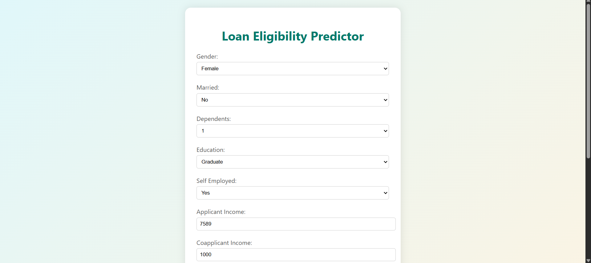
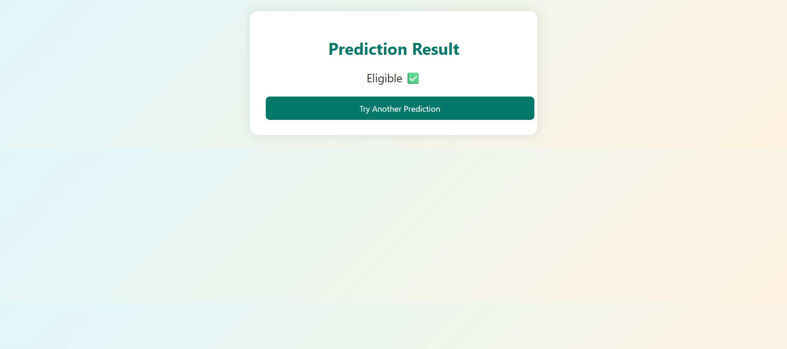

# 🏦 Loan Eligibility Predictor

A Flask-based web application that predicts whether a person is **eligible for a loan** based on input details such as income, loan amount, employment status, and more. This machine learning model is trained on real-world loan data and uses a **Random Forest Classifier** for prediction.

---

## 📌 Features

- 🔍 Predict loan eligibility using a trained machine learning model
- ✅ Clean, responsive, and interactive user interface
- 📈 Model Evaluation: ROC Curve, Accuracy, Confusion Matrix
- 🔐 Handles preprocessing, scaling, and encoding behind the scenes
- 📄 Displays result on a **separate result page** for a smooth user experience

---

## 🚀 Technologies Used

| Layer         | Technology               |
|---------------|--------------------------|
| Frontend      | HTML5, CSS3              |
| Backend       | Python, Flask            |
| ML Framework  | Scikit-learn             |
| Model         | Random Forest Classifier |
| Data Handling | Pandas, NumPy            |
| Deployment    | Localhost / Render-ready |

---

## 🧠 Model Evaluation

### 🔹 Random Forest Classifier
- **Accuracy**: `77.23%`
- **Model chosen for deployment** due to robustness and consistency.

---

### 🔹 Logistic Regression (Comparison)

- **Accuracy**: `78.86%`

---

## 🗂️ Project Structure

├── app.py # Flask backend

├── model.pkl # Trained Random Forest model

├── scaler.pkl # StandardScaler object

├── feature_names.pkl # Feature columns used for prediction

├── templates/

│ ├── index.html # Input form UI

│ └── result.html # Result display page

├── static/

│ └── style.css # Custom UI styles

└── README.md

## 💻 Demo

